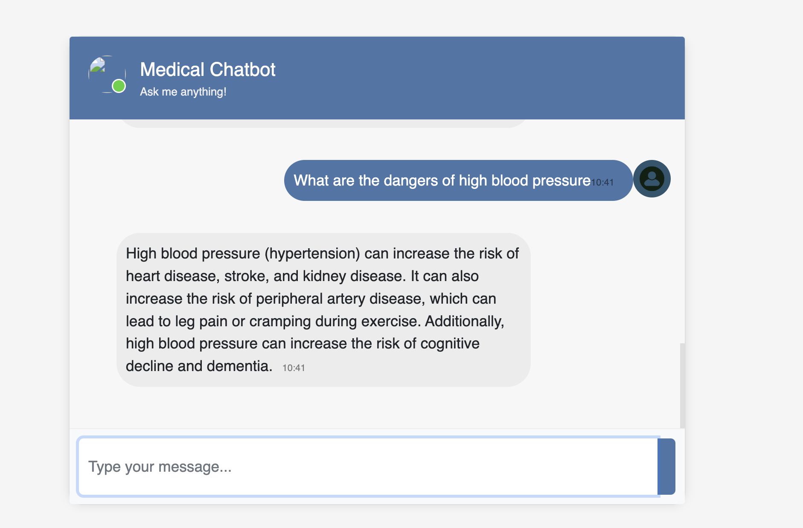
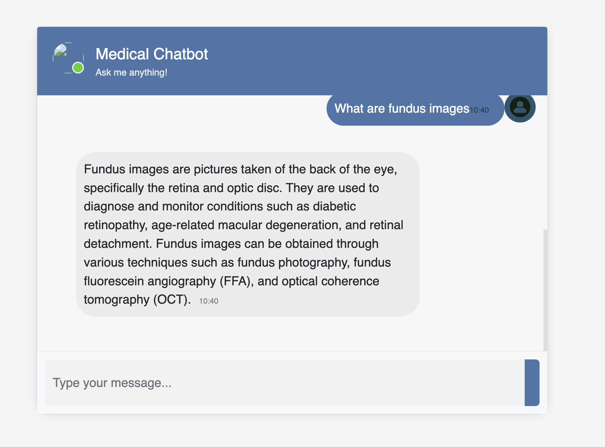
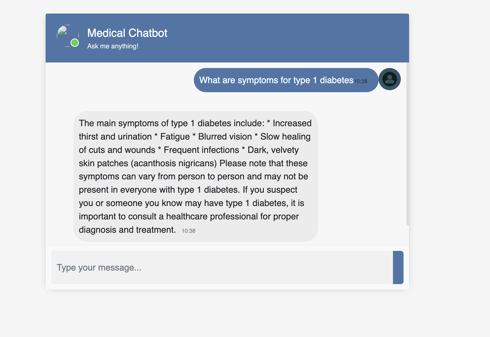

# llama_health_bot

## Overview
`llama_health_bot` is an end-to-end medical chatbot project using the Llama 2 7B model in GGML format. The bot utilizes VectorDB, PineCone, and LangChain to provide comprehensive health-related interactions.

## Setup Instructions

### 1. Create and Activate Conda Environment

```bash
conda create --name llama_health_bot python=3.8
conda activate llama_health_bot
```

### 2. Download the Llama model 

```bash
https://huggingface.co/TheBloke/Llama-2-7B-Chat-GGML/tree/main
```
model to use = llama-2-7b-chat.ggmlv3.q4_0.bin

**Why Use GGML?**
- Optimized Storage: Reduces file size and improves load times with binary encoding and compression.
- Enhanced Performance: Aligns with hardware architecture for faster data access and inference.
- Compatibility: Ensures smooth integration with various hardware and software stacks.
Efficiency: Streamlines model inference by structuring data for better manageability.

### 3. Run store_index.py
```bash 
python store_index.py
```

### 3. Run app.py
```bash 
python app.py
```

## Snapshots of the app



